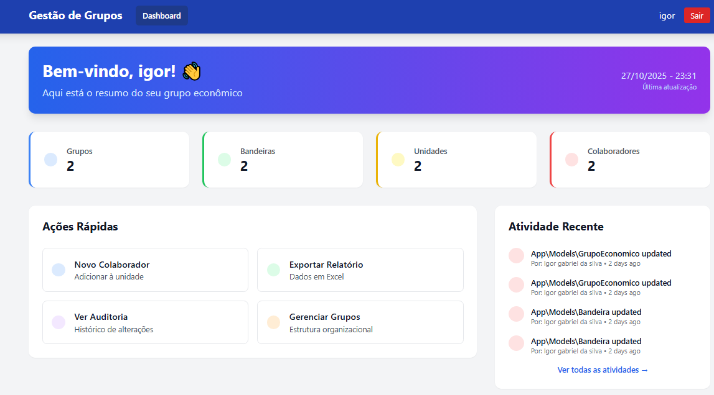
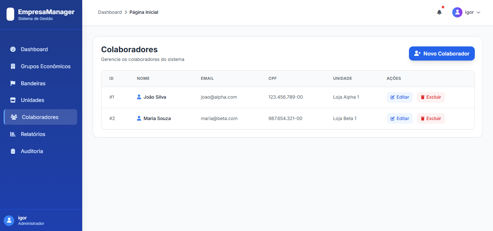

<h1 align="center">📊 EmpresaManager</h1>

<p align="center">
💼 Sistema de gestão empresarial com Laravel, Livewire e Tailwind CSS. Administra grupos econômicos, bandeiras, unidades e colaboradores de forma prática e moderna.
</p>

<p align="center">


</p>

---

## 📦 Instalação (Windows / Linux)

### 🧰 Requisitos

* PHP 8.2+
* Composer 2.x
* MySQL 8.x
* Node.js 18+ / NPM 9+
* Laravel 11
* Git

---

### ⚙️ Passo a passo

```bash
# Clonar o repositório
git clone https://github.com/seu-usuario/gestao-grupos.git
cd gestao-grupos

# Instalar dependências
composer install
npm install

# Criar e configurar .env
cp .env.example .env
php artisan key:generate

# Configurar banco
# (edite DB_DATABASE, DB_USERNAME, DB_PASSWORD no .env)

# Migrar e popular banco
php artisan migrate --seed

# Criar link de storage
php artisan storage:link

# Compilar assets
npm run dev

# Rodar servidor Laravel
php artisan serve
```

💡 Em outro terminal:

```bash
php artisan queue:work
```

---

## ☕ Uso do Sistema

1. Acesse [http://127.0.0.1:8000](http://127.0.0.1:8000)
2. Clique em **Registrar** e crie seu usuário
3. Faça login
4. Use o painel para:

   * Criar **Grupos Econômicos**
   * Adicionar **Bandeiras**
   * Cadastrar **Unidades** com CNPJ válido
   * Adicionar **Colaboradores**
   * Gerar **Relatórios Excel**
   * Visualizar **Auditoria**

---

## 🪄 Funcionalidades Principais

| 🔧 Recurso         | Descrição                                 |
| ------------------ | ----------------------------------------- |
| 🏢 Grupo Econômico | CRUD completo com auditoria               |
| 🏷️ Bandeira       | Vinculada ao grupo econômico              |
| 🏬 Unidade         | Validação de CNPJ, associada à bandeira   |
| 👥 Colaborador     | Vinculado à unidade                       |
| 📊 Relatórios      | Filtros dinâmicos + exportação Excel      |
| 🔐 Autenticação    | Laravel Breeze (Login e Registro)         |
| 🧾 Auditoria       | Registro de alterações com usuário e data |
| ⚙️ Filas           | Exportações processadas em background     |

---

## 🧪 Testes

Rodar todos os testes:

```bash
php artisan test
```

Testar manualmente os CRUDs via navegador ou Postman.

---

## 🧰 Tecnologias

| Tecnologia        | Uso                     |
| ----------------- | ----------------------- |
| Laravel 11.x      | Backend principal       |
| Livewire 3.x      | Componentes dinâmicos   |
| Tailwind CSS      | Front-end moderno       |
| Breeze            | Autenticação simples    |
| Maatwebsite/Excel | Exportação Excel        |
| Queue / Jobs      | Processos em background |
| PHPUnit           | Testes automatizados    |

---

## 🧱 Desenvolvimento

### Rodar ambiente completo:

```bash
php artisan serve
npm run dev
php artisan queue:work
```

### Testar dados diretamente:

```bash
php artisan tinker
```

---

## 📫 Contribuindo

```bash
git checkout -b minha-feature
git commit -m "Nova funcionalidade"
git push origin minha-feature
```

---

## 🤝 Colaboradores

| Nome              | Função                  |
| ----------------- | ----------------------- |
| **Igor Gabriel**  | 💻 Full Stack Developer |
| **Space Studios** | 🎮 Games & Apps         |

---

## 📝 Licença

MIT – veja [LICENSE](LICENSE)

---

## 🖼️ Prints

<p align="center">
<br/>
<sub>Dashboard interativo</sub>
</p>

<p align="center">
<br/>
<sub>Cadastro de colaboradores</sub>
</p>

---